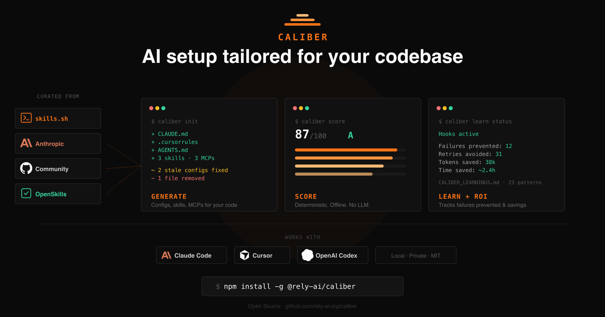
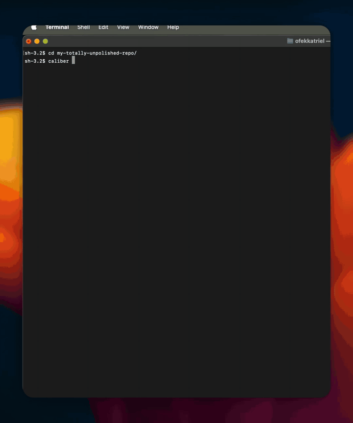

<p align="center">
  
</p>

<p align="center">
  <a href="https://www.npmjs.com/package/@rely-ai/caliber"></a>
  <a href="./LICENSE"></a>
  <a href="https://nodejs.org"></a>
</p>

<p align="center">
  
</p>

---

Caliber scans your project — languages, frameworks, dependencies, file structure — and generates tailored config files for **Claude Code**, **Cursor**, and **OpenAI Codex**. If configs already exist, it audits them against your actual codebase and suggests targeted improvements.

🔑 **API Key Optional** — use your existing Claude Code or Cursor subscription. Or bring your own key (Anthropic, OpenAI, Vertex AI, any OpenAI-compatible endpoint).

🧠 **BYOAI** — Caliber works where you do. All LLM processing runs through your own models — no data is sent to third parties.

### Why Caliber?

Caliber **generates, audits, and maintains** your agentic development sessions.

- 🏗️ **Generates, not just score** — builds your CLAUDE.md, Cursor rules, AGENTS.md, skills, and MCP configs from scratch
- 🔀 **Multi-agent** — one command sets up Claude Code, Cursor, and Codex together
- 🌍 **Any codebase** — TypeScript, Python, Go, Rust, Terraform, Java, Ruby — detection is fully LLM-driven, not hardcoded
- 🧩 **Finds and installs skills** — searches community registries and installs relevant skills for your stack
- 🔗 **Discovers MCP servers** — auto-detects tools your project uses and installs matching MCP servers
- 🔄 **Keeps configs fresh** — git hooks and session hooks auto-update your docs as your code changes
- ↩️ **Fully reversible** — automatic backups, score regression guard, and one-command undo

## 🚀 Quick Start

```bash
npx @rely-ai/caliber init
```

That's it. On first run, Caliber walks you through provider setup interactively.

Or install globally:

```bash
npm install -g @rely-ai/caliber
caliber init
```

> **Already have an API key?** Skip the interactive setup:
>
> ```bash
> export ANTHROPIC_API_KEY=sk-ant-...
> npx @rely-ai/caliber init
> ```

## ⚙️ How It Works

```
caliber init
│
├─ 1. 🔌 Connect      Choose your LLM provider — Claude Code seat, Cursor seat,
│                      or an API key (Anthropic, OpenAI, Vertex AI)
│
├─ 2. 🔍 Discover     Analyze languages, frameworks, dependencies, file structure,
│                      and existing agent configs via LLM
│
├─ 3. 🛠️  Generate     Create CLAUDE.md + skills in parallel (core docs via smart
│                      model, skills via fast model). Auto-polishes for max score
│
├─ 4. 👀 Review       See a diff of proposed changes — accept, refine via
│                      chat, or decline. All changes are backed up automatically
│
└─ 5. 🧩 Skills       Search community skill registries and install relevant
                       skills for your tech stack
```

Caliber works on **any codebase** — TypeScript, Python, Go, Rust, Terraform, Java, Ruby, and more. Language and framework detection is fully LLM-driven, not hardcoded.

### 📦 What It Generates

| File                        | Platform    | Purpose                                                             |
| --------------------------- | ----------- | ------------------------------------------------------------------- |
| `CLAUDE.md`                 | Claude Code | Project context — build/test commands, architecture, conventions    |
| `.cursor/rules/*.mdc`       | Cursor      | Modern rules with frontmatter (description, globs, alwaysApply)     |
| `.cursorrules`              | Cursor      | Legacy rules file (if no `.cursor/rules/` exists)                   |
| `AGENTS.md`                 | Codex       | Project context for OpenAI Codex                                    |
| `.claude/skills/*/SKILL.md` | Claude Code | Reusable skill files following [OpenSkills](https://agentskills.io) |
| `.cursor/skills/*/SKILL.md` | Cursor      | Skills for Cursor                                                   |
| `.agents/skills/*/SKILL.md` | Codex       | Skills for Codex                                                    |
| `.mcp.json`                 | Claude Code | MCP server configurations                                           |
| `.cursor/mcp.json`          | Cursor      | MCP server configurations                                           |
| `.claude/settings.json`     | Claude Code | Permissions and hooks                                               |

If these files already exist, Caliber audits them and suggests improvements — keeping what works, fixing what's stale, adding what's missing.

### 🛡️ Safety

Every change Caliber makes is reversible:

- 💾 **Automatic backups** — previous versions saved to `.caliber/backups/{timestamp}/` before every write
- 📊 **Score regression guard** — if a regeneration produces a lower score, changes are auto-reverted
- ↩️ **Full undo** — `caliber undo` reverts all changes made by Caliber
- 🔍 **Dry run** — preview any command's changes with `--dry-run`

## 📋 Commands

| Command              | Description                                          |
| -------------------- | ---------------------------------------------------- |
| `caliber init`       | 🏁 Initialize your project — full 5-step wizard      |
| `caliber score`      | 📊 Score your config quality (deterministic, no LLM) |
| `caliber skills`     | 🧩 Discover and install community skills             |
| `caliber regenerate` | 🔄 Re-analyze and regenerate your setup              |
| `caliber refresh`    | 🔃 Update docs based on recent code changes          |
| `caliber hooks`      | 🪝 Manage auto-refresh hooks                         |
| `caliber config`     | ⚙️ Configure LLM provider, API key, and model        |
| `caliber status`     | 📌 Show current setup status                         |
| `caliber undo`       | ↩️ Revert all changes made by Caliber                |

### Examples

```bash
# Initialize
caliber init                      # Interactive — picks agent, walks through setup
caliber init --agent claude       # Target Claude Code only
caliber init --agent cursor       # Target Cursor only
caliber init --agent codex        # Target OpenAI Codex only
caliber init --agent all          # Target all three
caliber init --agent claude,cursor # Comma-separated
caliber init --dry-run            # Preview without writing files
caliber init --force              # Overwrite existing setup without prompting

# Scoring
caliber score                        # Full breakdown with grade (A-F)
caliber score --json                 # Machine-readable output
caliber score --agent claude         # Score for a specific agent

# Day-to-day
caliber regenerate                   # Re-analyze and regenerate (alias: regen, re)
caliber refresh                      # Update docs from recent git changes
caliber refresh --dry-run            # Preview what would change
caliber skills                       # Browse and install community skills
caliber hooks                        # Toggle auto-refresh hooks
caliber hooks --install              # Enable all hooks non-interactively
caliber status                       # Show what Caliber has set up
caliber undo                         # Revert everything
```

## 📊 Scoring

`caliber score` gives you a deterministic, tech-stack-agnostic quality score. No LLM needed — it cross-references your config files against the actual project filesystem.

```
  Agent Config Score    88 / 100    Grade A

  FILES & SETUP                                17 / 17
  QUALITY                                      21 / 23
  GROUNDING                                    20 / 20
  ACCURACY                                     10 / 15
  FRESHNESS & SAFETY                           10 / 10
  BONUS                                         5 / 5
```

| Category               | Points | What it checks                                                     |
| ---------------------- | ------ | ------------------------------------------------------------------ |
| **Files & Setup**      | 25     | Config files exist, skills present, MCP servers, cross-platform parity |
| **Quality**            | 25     | Has code blocks, concise token budget, concrete instructions, structured headings |
| **Grounding**          | 20     | Config references actual project directories and files             |
| **Accuracy**           | 15     | Referenced paths exist on disk, config is in sync with code (git-based) |
| **Freshness & Safety** | 10     | Recently updated, no leaked secrets, permissions configured        |
| **Bonus**              | 5      | Auto-refresh hooks, AGENTS.md, OpenSkills format                   |

Every failing check includes structured fix data — when `caliber init` runs, the LLM receives exactly what's wrong and how to fix it.

## 🧩 Skills

Caliber searches three community registries and scores results against your project

```bash
caliber skills
```

Skills are scored by LLM relevance (0–100) based on your project's actual tech stack and development patterns, then you pick which ones to install via an interactive selector. Installed skills follow the [OpenSkills](https://agentskills.io) standard with YAML frontmatter.

## 🔄 Auto-Refresh

Keep your agent configs in sync with your codebase automatically:

| Hook                  | Trigger             | What it does                            |
| --------------------- | ------------------- | --------------------------------------- |
| 🤖 **Claude Code**    | End of each session | Runs `caliber refresh` and updates docs |
| 📝 **Git pre-commit** | Before each commit  | Refreshes docs and stages updated files |

Set up hooks interactively with `caliber hooks`, or non-interactively:

```bash
caliber hooks --install    # Enable all hooks
caliber hooks --remove     # Disable all hooks
```

The refresh command analyzes your git diff (committed, staged, and unstaged changes) and updates your config files to reflect what changed. It works across multiple repos if run from a parent directory.

## 🔌 LLM Providers

| Provider                       | Setup                                 | Default Model              |
| ------------------------------ | ------------------------------------- | -------------------------- |
| 🟣 **Claude Code** (your seat) | `caliber config` → Claude Code        | Inherited from Claude Code |
| 🔵 **Cursor** (your seat)      | `caliber config` → Cursor             | Inherited from Cursor      |
| 🟠 **Anthropic**               | `export ANTHROPIC_API_KEY=sk-ant-...` | `claude-sonnet-4-6`        |
| 🟢 **OpenAI**                  | `export OPENAI_API_KEY=sk-...`        | `gpt-4.1`                  |
| 🔴 **Vertex AI**               | `export VERTEX_PROJECT_ID=my-project` | `claude-sonnet-4-6`        |
| ⚪ **Custom endpoint**         | `OPENAI_API_KEY` + `OPENAI_BASE_URL`  | `gpt-4.1`                  |

Override the model for any provider: `export CALIBER_MODEL=<model-name>` or use `caliber config`.

Configuration is stored in `~/.caliber/config.json` with restricted permissions (`0600`). 🔒 API keys are never written to project files.

<details>
<summary>Vertex AI advanced setup</summary>

```bash
# Custom region
export VERTEX_PROJECT_ID=my-gcp-project
export VERTEX_REGION=europe-west1

# Service account credentials (inline JSON)
export VERTEX_PROJECT_ID=my-gcp-project
export VERTEX_SA_CREDENTIALS='{"type":"service_account",...}'

# Service account credentials (file path)
export VERTEX_PROJECT_ID=my-gcp-project
export GOOGLE_APPLICATION_CREDENTIALS=/path/to/service-account.json
```

</details>

<details>
<summary>Environment variables reference</summary>

| Variable                         | Purpose                                 |
| -------------------------------- | --------------------------------------- |
| `ANTHROPIC_API_KEY`              | Anthropic API key                       |
| `OPENAI_API_KEY`                 | OpenAI API key                          |
| `OPENAI_BASE_URL`                | Custom OpenAI-compatible endpoint       |
| `VERTEX_PROJECT_ID`              | GCP project ID for Vertex AI            |
| `VERTEX_REGION`                  | Vertex AI region (default: `us-east5`)  |
| `VERTEX_SA_CREDENTIALS`          | Service account JSON (inline)           |
| `GOOGLE_APPLICATION_CREDENTIALS` | Service account JSON file path          |
| `CALIBER_USE_CLAUDE_CLI`         | Use Claude Code CLI (`1` to enable)     |
| `CALIBER_USE_CURSOR_SEAT`        | Use Cursor subscription (`1` to enable) |
| `CALIBER_MODEL`                  | Override model for any provider         |

</details>

## 📋 Requirements

- **Node.js** >= 20
- **One LLM provider:** your **Claude Code** or **Cursor** subscription (no API key), or an API key for Anthropic / OpenAI / Vertex AI

## 🤝 Contributing

See [CONTRIBUTING.md](./CONTRIBUTING.md) for detailed guidelines.

```bash
git clone https://github.com/rely-ai-org/caliber.git
cd caliber
npm install
npm run dev      # Watch mode
npm run test     # Run tests
npm run build    # Compile
```

Uses [conventional commits](https://www.conventionalcommits.org/) — `feat:` for features, `fix:` for bug fixes.

## 📄 License

MIT
